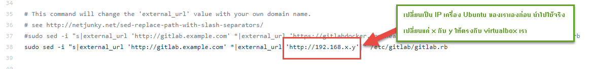
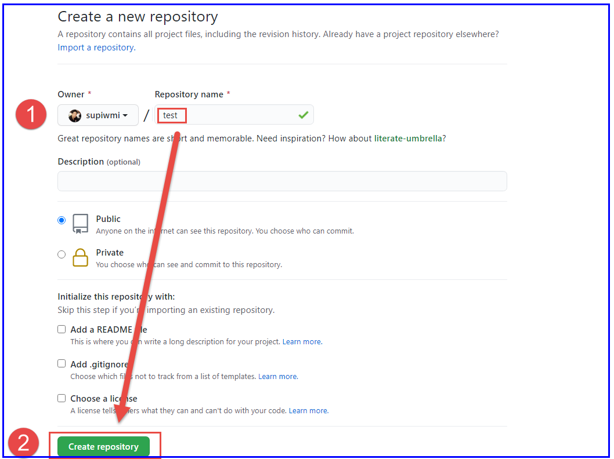
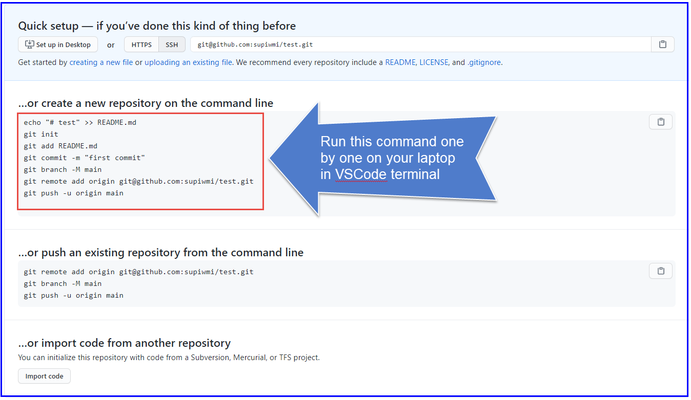
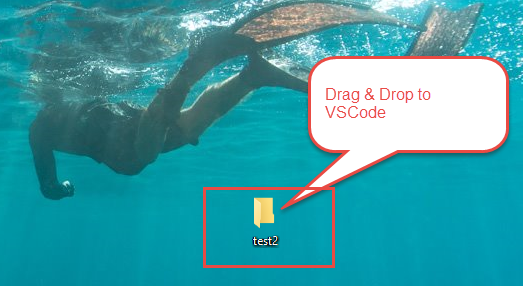
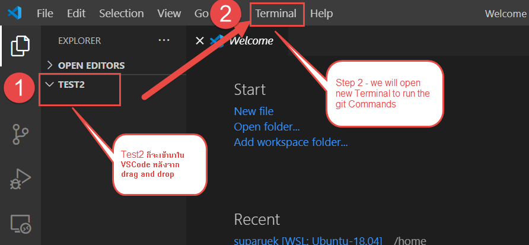
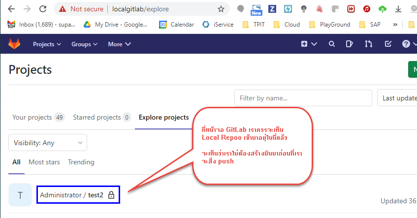

# OPS-C - โปรดทราบ มีให้ใหม่ ชื่อ 6-install-gitlab-ubuntu.sh

# LAB 1: How to install GitLab on Ubuntu server

เราสามารถเอา script (*6-install-gitlab-ubuntu.sh*) นี้ไปใช้ในการติดตั้ง GitLab บน VirtualBox ที่เป็น Ubuntu ได้แล้ว (ผ่านการทดสอบ) จะใช้เวลาติดตั้งหลาย 10-20 นาที่เพราะต้องไป download code 800MB ลงมา

ก่อนที่จะรันคำสั่ง "bash install-gitlab-ubuntu.sh"  ให้ IP แก้บรรทัดที่ 38 ใหัตรงกับเครื่อง unbutu ที่จะทำเป็น GitLab ก่อน (ตรวจสอบด้วย "ip a" เพื่อให้แน่ใจ)



หลังจากที่มันติดตั้งเสร็จ รอสัก 1-3 นาที่เพื่อให้โปรแกรมมัน start complete หลังจากนั้นก็ให้เราไปเปิดใช้งานผ่าน Browser

โดยการพิมพ์ URL ของ IP เครื่อง Ubuntu ที่เราจะสร้างเป็น GitLab server 

http://192.168.x.y 


# LAB 2: How to run jenkins with container

**Step 1:**

Create a new volume on docker host to keep jenkins configurations

> mkdir ~/myJenkinsVolume

**Step 2:**

Run jenkins container in detached mode

> docker run -d -p 8888:8080 -p 50000:50000 --restart=always --name devopsjenkins  -v ~/myJenkinsVolume:/var/jenkins_home -t -u root jenkins

**Step 3:**

Navigate to your Web Browser 

http://your_server_ip_or_domain:8888


# LAB 3: ถ้าต้องการ push จาก Local Repo (เครื่อง Windows เรา) to GitHub (GitHub ที่เราได้ Register ไว้)
ให้สร้าง repo ใหม่โดยไม่ต้องสร้าง readme มันจะใด้ตำสั่งแบบนี้มา





ให้เราเอาคำสั่งทั้งหมดนี้ไปรันที่ vscode ที่เครื่อง laptop เรา ก่อนรันอาจจะสร้างเป็น new folder ใน Windows ที่ dirve C หรือ D ก็ได้ เสร็จแล้วก็ drag and drop ชื่อนี้ไปที่ vscode
เพื่อที่ว่ามันจะได้รู้จักับ folder ที่เราสร้างนี้

**ทำทีละคำสั่ง บรรทัดที่ 5 ต้องเป็นชื่อ repo เราเอง**
```
echo "# Test" >> README.md
git init
git add README.md
git commit -m "first commit"
git remote add origin  git@github.com:supiwmi/test.git
git push -u --set-upstream origin master
```

คำสั่งบรรทัดล่างเป็นการทำให้มีการ sync กันระหว่าง remote และ local

git push -u --set-upstream origin master

ลองแก้ไขไฟล์ README.md

แล้วสั่ง
```
git add .
git commit -m "second"
git push
```
จะสั่งเห็นเราก็สามารถสั่งแค่ push ก็พอแล้ว และเมื่อกลับเข้าไปดูที่ GitHub จะเห็นว่าเราสามารถ push local repo เราไปที่ GitHub ได้แล้ว

# LAB 4:ถ้าต้องการ push จาก Local Repo (เครื่อง Laptop เรา)  ไปที่ GitLab (ถ้ามี Gitlab VirtualBox ก็ได้)

ขั้นตอนจะเหมือนกันแต่จะง่ายกว่าเพราะว่าเราเป็น เจ้าของ GitLab server แต่ ถ้าเป็น GitHub เราไปใช้ของฟรีที่ไม่ใช่ของเรา

**Step 1:**
เริ่มด้วยการสร้าง New Folder ในเครื่อง  Windows เรา ขี้นมา เช่น สร้าง new folder บน desktop ชื่อ Test2



**Step 2:**
เปิดโปรแกรม VSCode ขึ้นมาแล้ว ลาก ชื่อ folder "Test2" ที่อยู่บน Windows Destop เรามาวางในหน้าจอ VSCode 



**Step 3:** 
ให้เปิด Terminal ที่ VSCode เพื่อจะได้รันคำสั่งในการต่างๆเพื่อทดสอบ

*Note: อย่าลืมเปลี่ยนคำบรรทัดที่ 5 ---> git remote add origin git@192.168.x.y:root/test2.git ต้องเป็น IP ของ GitLab VirtualBox เราเท่านั้น*

```
echo "# Test" >> README.md
git init
git add README.md
git commit -m "first commit"
git remote add origin git@192.168.56.8:root/test2.git
git push -u origin master
```

**Step 4:**
เสร็จแล้วไปดูที่ GitLab ที่อยู่ใน VirtualBox เราว่ามันได้แบบนี้หรือไม่



# LAB 6:ถ้าต้องการ pull จากที่ GitHub (จะเป็นของใครก็ได้ เช่น git pull git@github.com:supiwmi/opsc.git)  ไปที่ GitLab (ถ้ามี Gitlab VirtualBox ก็ได้)

ขั้นตอนจะเหมือนกันกับ Lab 5 และ 6

**Steps:**
```
สร้าง new folder เช่น temp
git init
git pull git@github.com:supiwmi/opsc.git
git remote add origin git@192.168.56.8:root/test2.git
git push -u origin master
```
เราก็จะสามารถเอา code จากที่อื่น(ที่คนอื่น share เป็น public) มาใส่ไว้ใน Private Git (เช่น GitLab on VirtualBox) ของเราได้แล้ว

# -------- ลองเอาไปช่วยในการทำงานดูนะเพื่อมีประโยชน์ ---------

**Git Tips and Trick**

On StackOverflow, the following command was suggested to help developers find the location of the Git config files: 
```
sudo git -c core.editor=ls\ -al config --system --edit
sudo git -c core.editor=ls\ -al config --global --edit
git config --global --list --show-origin
```

**แนะนำให้อ่านเพิ่มเติม**
https://docs.github.com/en/free-pro-team@latest/github/importing-your-projects-to-github/adding-an-existing-project-to-github-using-the-command-line
