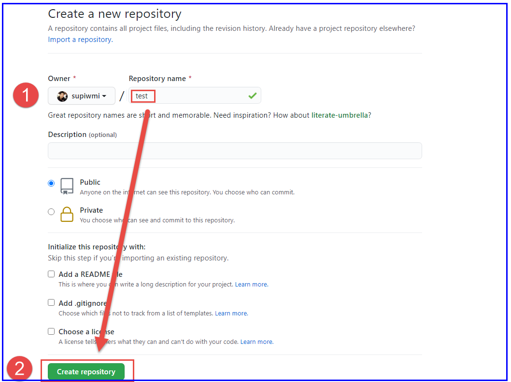

# opsc - How to run jenkins with container
# https://tpit-band-live.web.app/

# Step 1:

Create a new volume on docker host to keep jenkins configurations

> mkdir ~/myJenkinsVolume

# Step 2:

Run jenkins container in detached mode

> docker run -d -p 8888:8080 -p 50000:50000 --restart=always --name devopsjenkins  -v ~/myJenkinsVolume:/var/jenkins_home -t -u root jenkins

# Step 3:

Navigate to your Web Browser 

http://your_server_ip_or_domain:8888

# Git Tips and Trick
On StackOverflow, the following command was suggested to help developers find the location of the Git config files: sudo git -c core.editor=ls\ -al config --system --edit

sudo git -c core.editor=ls\ -al config --global --edit

git config --global --list --show-origin

# PUSH local  REPO to GitHub
ให้สร้าง repo ใหม่โดยไม่ต้องสร้าง readme มันจะใด้ตำสั่งแบบนี้มา

git init
git add README.md
git commit -m "first commit"
git remote add origin  git@github.com:supiwmi/test.git
git push -u --set-upstream origin master

เป็นการทำให้มีการ sync กันระหว่าง remote และ local

git push -u --set-upstream origin master

ลองแก้ไขไฟล์ README.md

แล้วสั่ง
git add .
git commit -m "second"

เราก็สามารถสั่งแค่ push ก็พอแล้ว
git push

ดูเพิ่มเติม
https://docs.github.com/en/free-pro-team@latest/github/importing-your-projects-to-github/adding-an-existing-project-to-github-using-the-command-line
